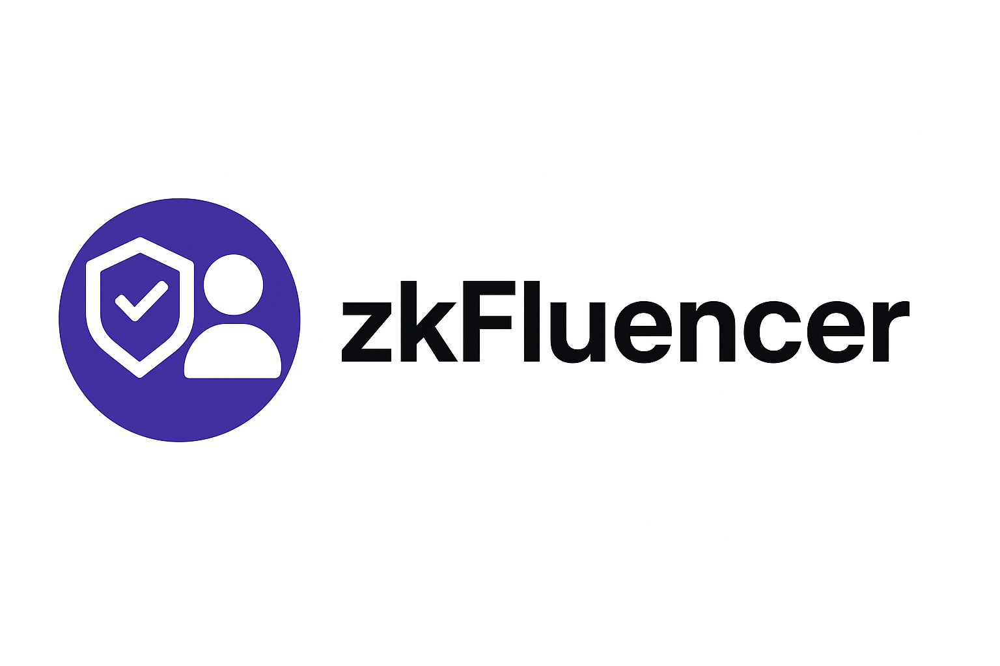

# zkFluencer

**Privacy-Preserving Creator Marketing Platform on Farcaster**

A Farcaster Mini App that revolutionizes influencer marketing by enabling creators to participate in brand campaigns while maintaining privacy through zero-knowledge proofs. Built on the Celo blockchain with seamless Farcaster integration.



## 🌟 Overview

zkFluencer connects brands with content creators for authentic social media campaigns, leveraging zero-knowledge proofs to verify creator credentials and social metrics without exposing sensitive data. The platform operates as a Farcaster Mini App, providing a native mobile-first experience within the Farcaster ecosystem.

### Key Features

- **🔐 Privacy-First Verification**: Zero-knowledge proofs verify creator credentials without exposing personal data
- **🎯 Farcaster Integration**: Native Mini App with seamless authentication and user data integration
- **💰 Campaign Marketplace**: Discover and join brand campaigns with transparent reward structures
- **👥 Multi-Role Support**:
  - **Creators**: Browse campaigns, submit content, earn rewards
  - **Brands**: Create campaigns, review submissions, distribute rewards
- **🌐 Web3 Wallet Integration**: Secure on-chain transactions via Wagmi/Viem
- **📊 Real-time Analytics**: Track campaign participation, submissions, and earnings
- **📱 Mobile-Optimized**: Responsive design for seamless mobile experience

### Campaign Categories

- **Social Content**: Share authentic experiences with products and services
- **Educational Tutorials**: Create beginner-friendly blockchain tutorials
- **Product Reviews**: In-depth reviews of dApps and ecosystem tools
- **Community Engagement**: Drive awareness and adoption in Web3 communities

## 🏗️ Project Structure

This is a monorepo managed by Turborepo:

```
zkFluenceApp/
├── apps/
│   ├── web/              # Next.js 15 Frontend Application
│   │   ├── src/
│   │   │   ├── app/                    # App Router pages
│   │   │   │   ├── creator/            # Creator dashboard & flows
│   │   │   │   ├── company/            # Brand dashboard & flows
│   │   │   │   ├── api/                # API routes
│   │   │   │   └── .well-known/        # Farcaster manifest
│   │   │   ├── components/             # React components
│   │   │   │   ├── ui/                 # shadcn/ui components
│   │   │   │   ├── onboarding-wizard.tsx
│   │   │   │   ├── campaign-card.tsx
│   │   │   │   └── wallet-connect.tsx
│   │   │   ├── contexts/               # React contexts
│   │   │   │   └── miniapp-context.tsx # Farcaster SDK context
│   │   │   ├── hooks/                  # Custom React hooks
│   │   │   └── lib/                    # Utilities & helpers
│   │   ├── public/
│   │   │   └── .well-known/
│   │   │       └── farcaster.json      # Mini App manifest
│   │   ├── next.config.mjs
│   │   ├── postcss.config.mjs
│   │   └── package.json
│   └── contracts/        # Smart Contract Development
│       ├── contracts/                  # Solidity contracts
│       ├── scripts/                    # Deployment scripts
│       ├── test/                       # Contract tests
│       └── hardhat.config.ts
├── packages/             # Shared packages (if any)
├── turbo.json           # Turborepo configuration
└── package.json         # Root package.json
```

## 🚀 Getting Started

### Prerequisites

- Node.js 20+ and pnpm
- Farcaster account for testing Mini App features
- Celo wallet for blockchain interactions

### Installation

1. **Clone the repository**
   ```bash
   cd zkFluenceApp
   ```

2. **Install dependencies**
   ```bash
   pnpm install
   ```

3. **Set up environment variables**
   ```bash
   cp apps/web/.env.template apps/web/.env.local
   ```

   Configure the following variables:
   - `NEXT_PUBLIC_FARCASTER_APP_URL`: Your app's production URL
   - `NEXT_PUBLIC_WALLET_CONNECT_PROJECT_ID`: WalletConnect project ID
   - `NEXT_PUBLIC_CELO_RPC_URL`: Celo RPC endpoint

4. **Start development server**
   ```bash
   pnpm dev
   ```

5. **Open [http://localhost:3000](http://localhost:3000)**

### Testing as a Farcaster Mini App

1. Deploy to Vercel or ngrok for HTTPS
2. Update `public/.well-known/farcaster.json` with your domain
3. Open in Warpcast mobile app to test Mini App features

## 📱 User Workflows

### Creator Workflow

1. **Onboarding**
   - Connect Farcaster account (automatic via Mini App SDK)
   - Link Web3 wallet for rewards
   - Complete creator profile

2. **Discover Campaigns**
   - Browse available campaigns in the feed
   - Filter by category, reward, and requirements
   - View campaign details and requirements

3. **Join & Submit**
   - Join campaign with one tap
   - Create and submit content
   - Track submission status

4. **Earn Rewards**
   - Receive crypto rewards upon approval
   - View earnings dashboard
   - Withdraw to wallet

### Brand Workflow

1. **Campaign Creation**
   - Define campaign objectives and requirements
   - Set budget and reward structure
   - Configure submission criteria

2. **Creator Discovery**
   - View creator applications
   - Review creator profiles and metrics
   - Select participants

3. **Review & Approve**
   - Review submitted content
   - Approve/reject submissions
   - Distribute rewards automatically

4. **Analytics**
   - Track campaign performance
   - View engagement metrics
   - Export results

## 🛠️ Tech Stack

### Frontend
- **Framework**: Next.js 15.1.3 with App Router
- **Language**: TypeScript 5.9.3
- **Styling**: Tailwind CSS v4.1.9
- **UI Components**: shadcn/ui (Radix UI primitives)
- **State Management**: React Context API
- **Forms**: React Hook Form + Zod validation

### Web3 Integration
- **Farcaster**:
  - `@farcaster/frame-sdk` (Mini App SDK)
  - `@farcaster/quick-auth` (Authentication)
  - `@farcaster/miniapp-wagmi-connector` (Wallet connector)
- **Wallet**: Wagmi v2.19 + Viem v2.39
- **Blockchain**: Celo (Alfajores testnet, Mainnet)

### Smart Contracts
- **Framework**: Hardhat
- **Language**: Solidity
- **Testing**: Chai + Ethers.js
- **Deployment**: Hardhat Deploy

### Infrastructure
- **Monorepo**: Turborepo
- **Package Manager**: PNPM
- **Deployment**: Vercel
- **Analytics**: Vercel Analytics

## 📦 Available Scripts

### Development
```bash
pnpm dev              # Start all development servers
pnpm dev:web          # Start only web app
pnpm build            # Build all packages and apps
pnpm lint             # Lint all packages
pnpm type-check       # Run TypeScript checks
```

### Smart Contracts
```bash
pnpm contracts:compile              # Compile contracts
pnpm contracts:test                 # Run contract tests
pnpm contracts:deploy               # Deploy to local network
pnpm contracts:deploy:alfajores     # Deploy to Celo Alfajores testnet
pnpm contracts:deploy:celo          # Deploy to Celo mainnet
```

### Web App
```bash
cd apps/web
pnpm dev              # Start Next.js dev server
pnpm build            # Build for production
pnpm start            # Start production server
pnpm lint             # Lint web app
```

## 🔧 Configuration

### Farcaster Mini App Manifest

Located at `apps/web/public/.well-known/farcaster.json`:

```json
{
  "accountAssociation": {
    "header": "...",
    "payload": "...",
    "signature": "..."
  },
  "frame": {
    "version": "1",
    "name": "zkFluencer",
    "iconUrl": "https://your-domain/icon.png",
    "homeUrl": "https://your-domain",
    "buttonTitle": "Launch zkFluencer"
  }
}
```

### Next.js Configuration

Key features in `next.config.mjs`:
- ESLint disabled during builds (for faster deployments)
- TypeScript build errors enabled
- Webpack externals for Web3 packages
- Image optimization disabled for Farcaster compatibility

### Tailwind CSS v4

Using CSS-based configuration in `apps/web/src/app/globals.css`:
- Custom color scheme with dark mode support
- Design tokens via CSS variables
- Responsive breakpoints
- Custom animations

## 🌐 Deployment

### Vercel (Recommended)

1. Connect repository to Vercel
2. Configure environment variables
3. Set root directory to `apps/web`
4. Deploy

### Manual Deployment

```bash
cd apps/web
pnpm build
pnpm start
```

## 🔐 Security & Privacy

- **Zero-Knowledge Proofs**: Creator verification without data exposure
- **Web3 Authentication**: Decentralized identity via Farcaster
- **Smart Contract Security**: Audited reward distribution
- **Privacy-First**: Minimal data collection, maximum user control

## 🤝 Contributing

Contributions are welcome! Please feel free to submit a Pull Request.

## 📄 License

This project is licensed under the MIT License.

## 🔗 Links

- **Live App**: [https://zk-fluence.vercel.app](https://zk-fluence.vercel.app)
- **Documentation**: Coming soon
- **Discord**: Coming soon
- **Twitter**: Coming soon

## 🙏 Acknowledgments

- Built during ETHGlobal Buenos Aires 2025
- Powered by Celo blockchain
- Integrated with Farcaster protocol
- UI components by shadcn/ui

---

**Note**: This is a hackathon project built for ETHGlobal Buenos Aires 2025. For production use, additional security audits and testing are recommended.
