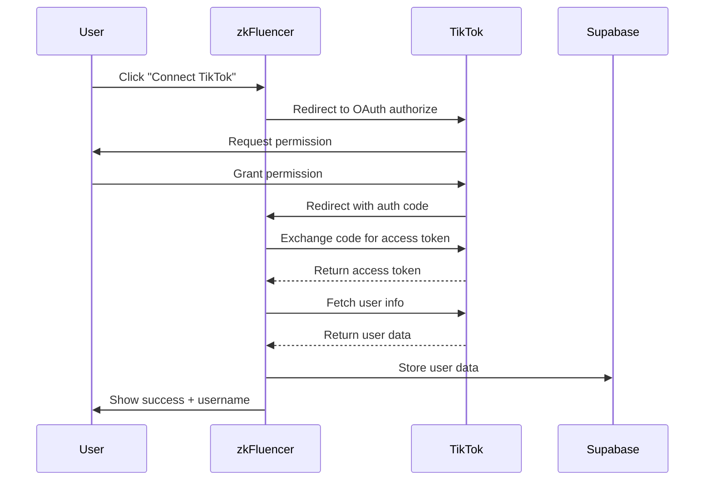

# TikTok OAuth Integration Setup Guide

This guide explains how to configure TikTok Login Kit for zkFluencer platform.

## Overview

The TikTok OAuth integration allows creators to connect their TikTok accounts to participate in campaigns. We retrieve:
- Username and display name
- Avatar/profile picture
- Follower count
- Engagement metrics (calculated from likes, followers, and video count)
- Verified status

## Step 1: Create TikTok Developer Account

1. Go to [TikTok Developers Portal](https://developers.tiktok.com/)
2. Sign in with your TikTok account
3. Complete the developer registration process

## Step 2: Create a New App

1. Navigate to **My Apps** → **Create an App**
2. Fill in the application details:
   - **App Name**: zkFluencer
   - **App Type**: Web App
   - **Description**: Privacy-preserving creator marketing platform
   - **Category**: Social Media
3. Submit for review (approval usually takes 1-2 business days)

## Step 3: Configure Login Kit

1. Once approved, go to your app dashboard
2. Click **Add Products** → Enable **Login Kit**
3. Configure Login Kit settings:
   - **Login redirect domain**: Add your production domain (e.g., `zk-fluence.vercel.app`)
   - **Login redirect URI**: Add callback URL:
     ```
     https://zk-fluence.vercel.app/api/auth/tiktok/callback
     ```
   - For local testing, also add:
     ```
     http://localhost:3000/api/auth/tiktok/callback
     ```

## Step 4: Configure Scopes

In the Login Kit settings, request the following scopes:
- ✅ `user.info.basic` - Username, display name, avatar
- ✅ `user.info.profile` - Bio, follower count
- ✅ `user.info.stats` - Follower count, following count, video count

## Step 5: Get Credentials

1. In your app dashboard, navigate to **Settings** → **Basic Information**
2. Copy the following credentials:
   - **Client Key** (Public)
   - **Client Secret** (Keep this secret!)

## Step 6: Configure Environment Variables

Add the credentials to your `.env` file:

```bash
# TikTok OAuth Configuration
NEXT_PUBLIC_TIKTOK_CLIENT_KEY=your-client-key-here
TIKTOK_CLIENT_SECRET=your-client-secret-here
```

**Important**: Never commit `.env` to version control!

## Step 7: Test the Integration

### Local Testing

1. Start your development server:
   ```bash
   pnpm dev
   ```

2. Navigate to any campaign page and click "Participate"
3. Click the "Connect TikTok" button
4. You'll be redirected to TikTok for authorization
5. After approval, you'll be redirected back with your account connected

### Production Testing

1. Deploy your app to Vercel
2. Update TikTok app settings with your production domain
3. Test the flow in production environment

## OAuth Flow



## Data Stored

The following TikTok data is stored in Supabase `creators` table:

| Field | Description | Example |
|-------|-------------|---------|
| `tiktok_username` | TikTok handle | `@cryptoartist` |
| `tiktok_followers` | Follower count | `125000` |
| `tiktok_engagement_rate` | Calculated engagement | `4.25` (%) |

## Engagement Rate Calculation

```typescript
engagementRate = (totalLikes / (followers × videoCount)) × 100
```

This provides a normalized metric for comparing creators regardless of follower count.

## Troubleshooting

### "Invalid redirect_uri" Error
- Ensure the redirect URI in your TikTok app settings matches exactly
- Check for trailing slashes
- Verify protocol (http vs https)

### "Insufficient permissions" Error
- Check that all required scopes are enabled in Login Kit settings
- Re-authorize the app with updated scopes

### Token Exchange Failed
- Verify `TIKTOK_CLIENT_SECRET` is set correctly
- Check that the authorization code hasn't expired (valid for 10 minutes)

### No User Data Returned
- Ensure scopes `user.info.basic`, `user.info.profile`, and `user.info.stats` are approved
- Check TikTok API status at [status.tiktok.com](https://status.tiktok.com)

## Security Best Practices

1. **Never expose Client Secret**: Keep it server-side only
2. **Validate state parameter**: Prevent CSRF attacks
3. **Use HTTPS in production**: Required by TikTok
4. **Implement rate limiting**: Prevent abuse of OAuth flow
5. **Store tokens securely**: Use encrypted storage for access tokens

## API References

- [TikTok Login Kit Documentation](https://developers.tiktok.com/doc/login-kit-web/)
- [TikTok OAuth 2.0 Guide](https://developers.tiktok.com/doc/oauth-user-access-token-management/)
- [TikTok User Info API](https://developers.tiktok.com/doc/tiktok-api-v2-get-user-info/)

## Support

For TikTok integration issues:
- TikTok Developer Support: [developers.tiktok.com/support](https://developers.tiktok.com/support)
- zkFluencer Issues: [GitHub Issues](https://github.com/your-repo/issues)
